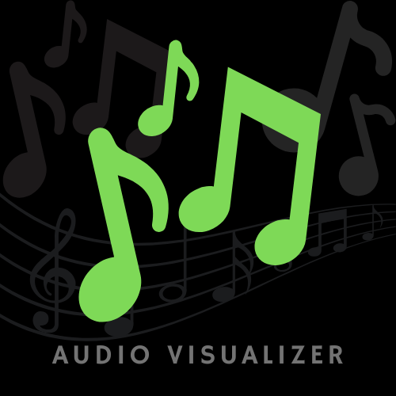

# 🎧 NeonPulse - A Web Based Audio Visualizer

<div align="center">
  

  **Transform your Music/Audio/Sounds into Aesthetic Pulses!**

[](https://developer.mozilla.org/en-US/docs/Web/HTML)
[](https://developer.mozilla.org/en-US/docs/Web/CSS)
[](https://developer.mozilla.org/en-US/docs/Web/JavaScript)

</div>


**NeonPulse** is a futuristic, real-time audio visualizer built using **HTML5  CSS & JAVASCRIPT (Vanilla)** and Whether you upload your favorite track or use your microphone, EchoPulse transforms sound into stunning neon visual pulses.

---

## 🚀 Features

✨ Sleek Neon UI
🎵 Upload and Visualize Local Audio Files
🎙️ Real-time Microphone Support
⏸️ Pause & Resume Functionality
♻️ Reset Audio Input Anytime
🖥️ Fully Responsive Design
🌐 One-Page, Zero-Setup HTML App
☰ Toggle Immersive Mode for Clean View

---

## 🛠️ Built With

- HTML + CSS
- JavaScript (Vanilla)

---

> Works best with tracks that have dynamic beats & bass.

---

## 📂 How to Run

1. **Clone the Repository**

```bash
git clone https://github.com/jishanahmed-shaikh/NeonPulse.git
cd NeonPulse
```

2. **Open `index.html`** in your browser.
   No build tools or server needed.

---

## 📁 Project Structure

```
📁 audiovisualizer-web
├── index.html
├── favicon.png
├── README.md
```

---

## ✨ Upcoming Enhancements

- 🎨 Theme customization (purple, cyberpunk, etc.)
- 📱 Optimized mobile experience
- 🔊 Waveform visual mode
- 🎶 Optional Spotify or streaming API support

---

## 🔗 Live & Source

- 🌐 [Live Demo](https://jishanahmed-shaikh.github.io/NeonPulse/)
- 🧠 [GitHub Repository](https://github.com/jishanahmed-shaikh/NeonPulse)
- 📺 [YouTube Presentation](https://youtu.be/wlosH8iqsS8)

---

## 🧑‍💻 Author

**Jishanahmed AR Shaikh**

💼 [LinkedIn](https://www.linkedin.com/in/jishanahmedshaikh)

📩 shaikhjishan255@gmail.com

👻 Snapchat: `jishanahmed2209`

⭐ Instagram: [@jishanahmed_shaikh](https://instagram.com/jishanahmed_shaikh)

---

## 📜 License

Released under the MIT License. Feel free to use, share, and remix with credit.

---

> 🎶 *"Turn sound into sight - Echo the Pulse Via NeonPulse."*
> — Jishanahmed *AR Shaikh*
